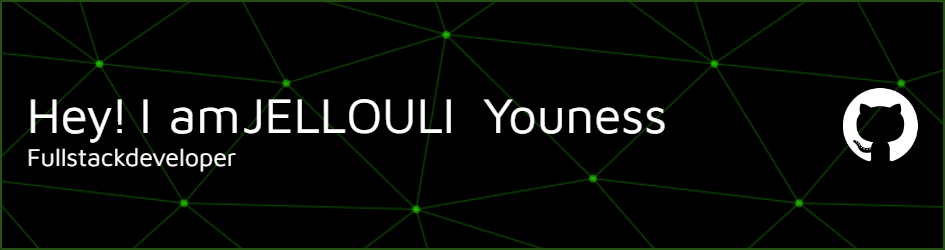

<!--  -->
<h1 align="center">Hi 👋, I'm JELLOULI Youness</h1>
<h3 align="center">A software engineering student from Morocco. I'm passionate about web development. I believe in the power of technology to transform lives and create meaningful solutions. Let's connect and collaborate on exciting projects to make a positive impact!</h3>

<h3 align="left">Connect with me:</h3>

<h3 align="left">Languages and Tools:</h3>

                 

&nbsp;

